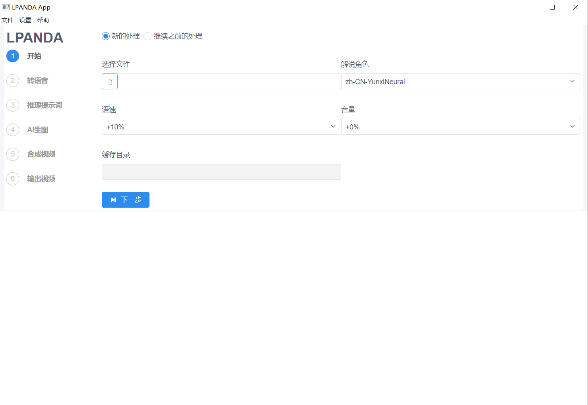
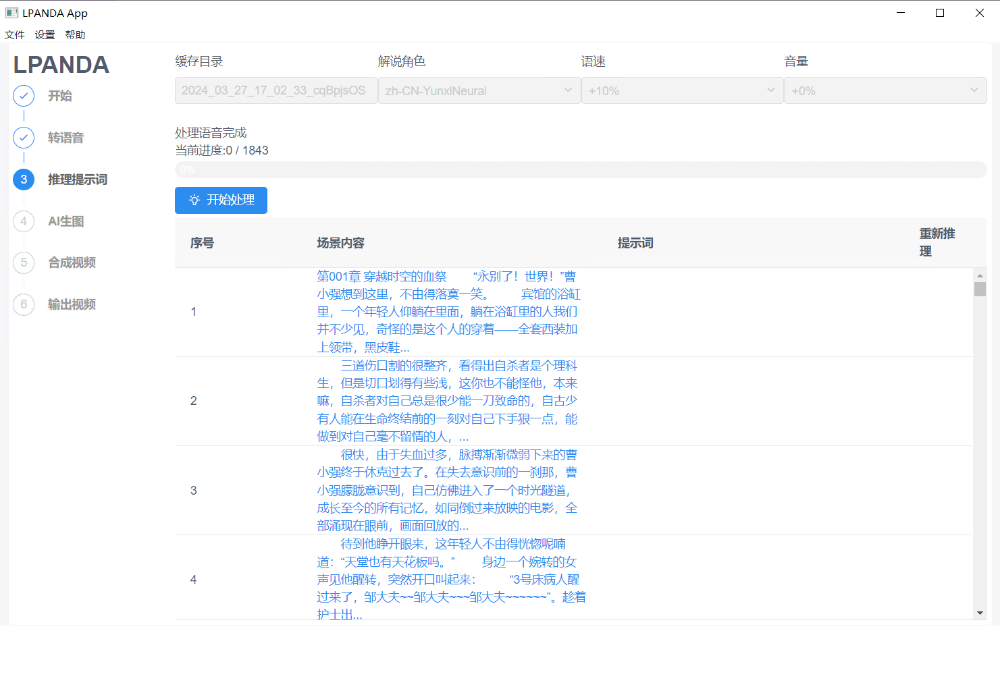
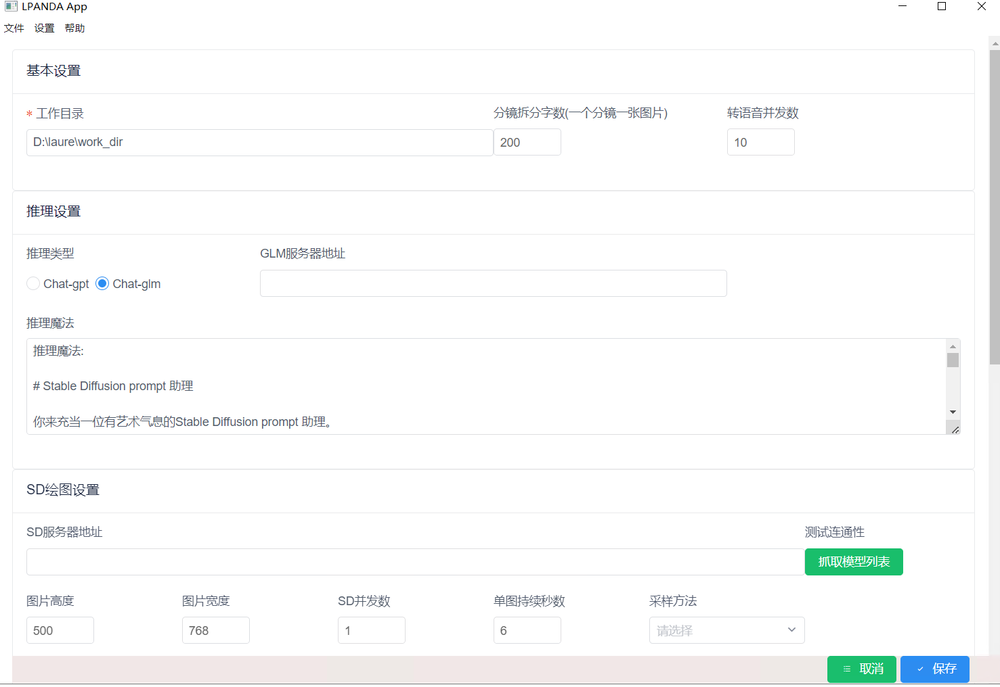

#AI 小说生成推文漫画视频
##功能
  ### 对接SD,GPT自动推理和生图
  ### 自动生成视频和字母
  ### 只需要提供小说，支持小说字数理论上无上线。
  ### 自动调用tts生成语音
##开发环境准备：
  ### 要求python3.10+ ,node.js 14+

  进入项目目录
  ### python -m venv py
  ### .\py\Scripts\pip.exe install -r .\requirements.txt

  ### 下载ffmpeg，放到pscripts/libs目录下。
  也可以到网盘下载ffmpeg:
  通过网盘分享的文件：ffmpeg
链接: https://pan.baidu.com/s/1hgtTEKsvWGG9k5gYMAwVTw?pwd=pwvs 提取码: pwvs 

npm install
最后npm start运行程序
打包成.exe，运行 npm run package

